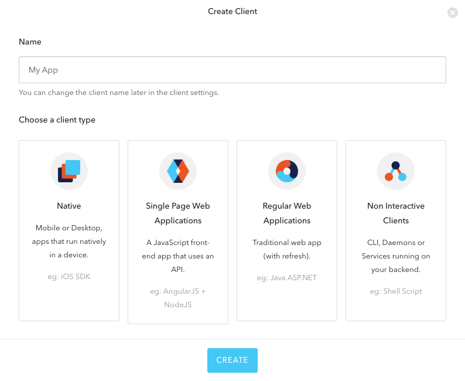

# Create and configure an Auth0 client

### Step 1: Create a client application (or reuse the default app) 
1. In "Clients", click on the button "CREATE CLIENT" 

2. Define your application name and select "Regular Web Applications" as client type.

### Step 1: Configure the client settings
1. Your application should have the client type "Regular Web Application" and the Token Endpoint Authentication Method "POST".

2. Below, enable "Use Auth0 instead of the IdP to do Single Sign On"

3. (Recommended) Add the rule "Force email verification"

